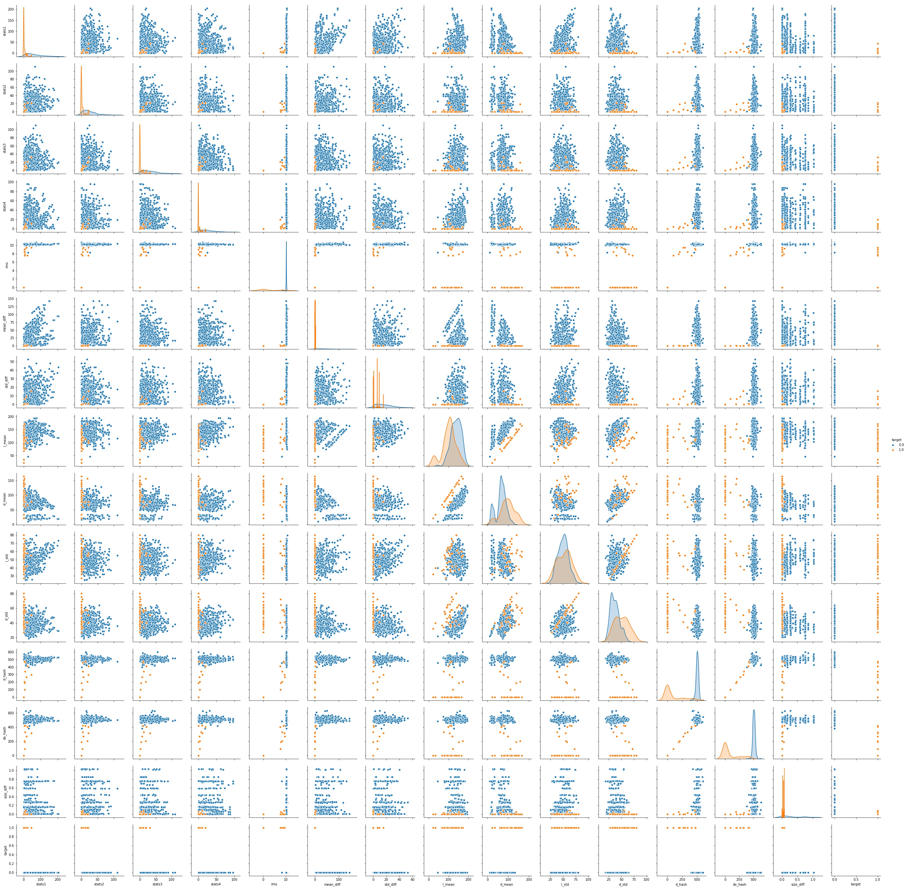
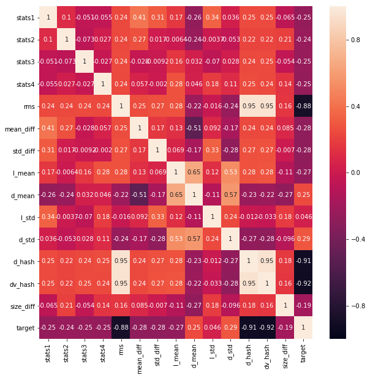
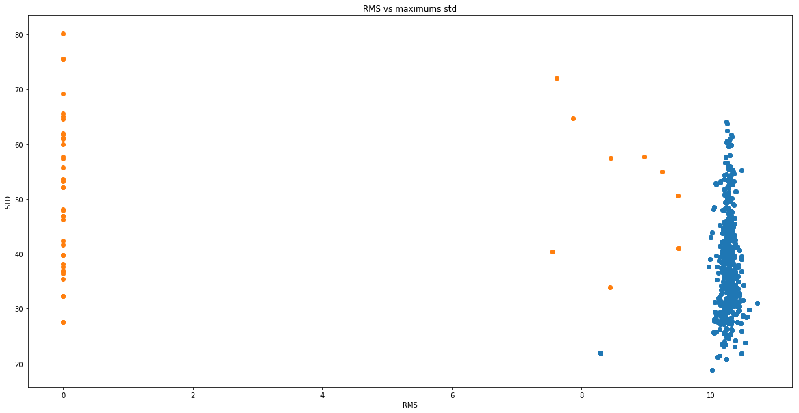
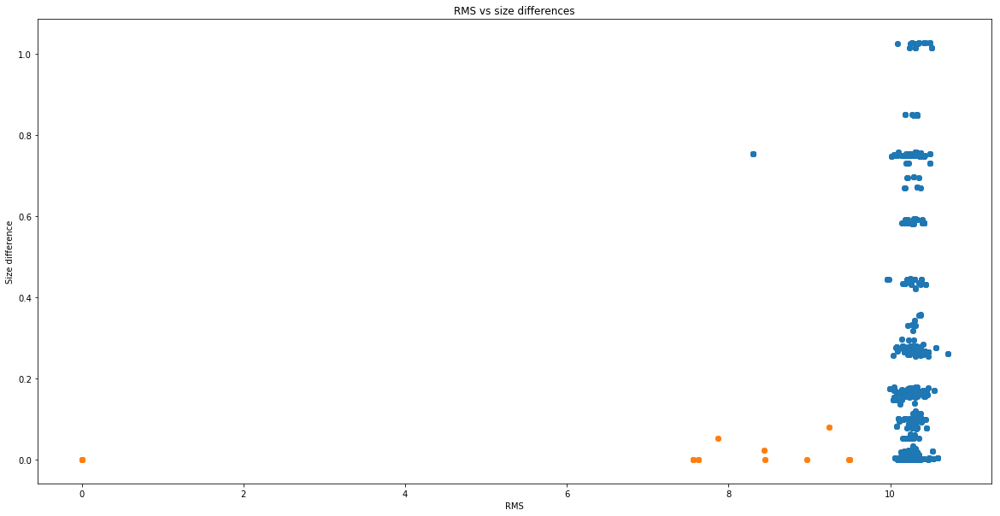
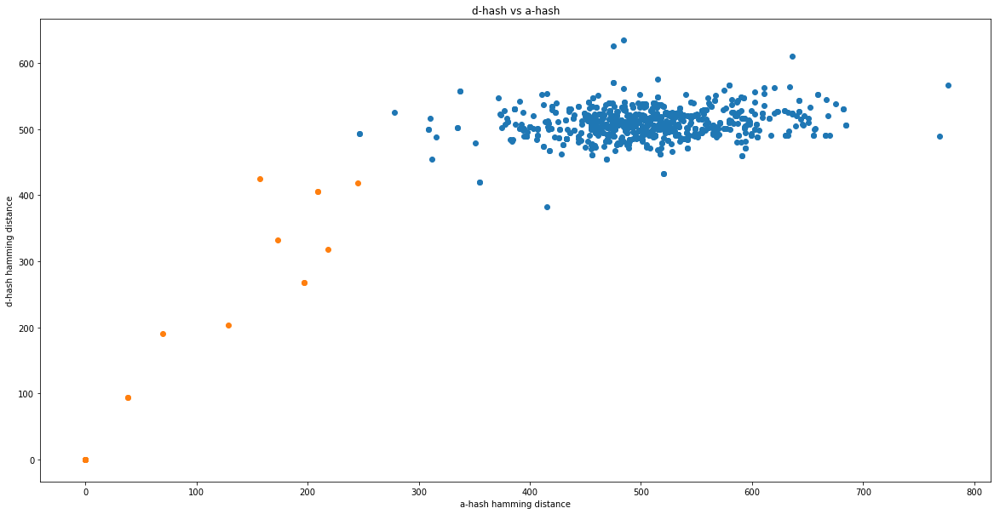
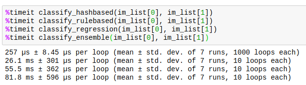
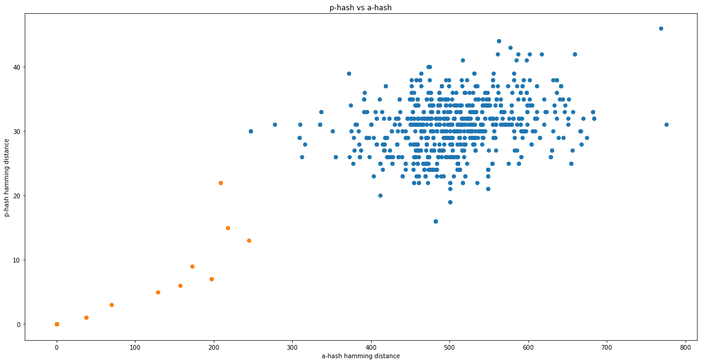

# Rails Reactor ML Test task

## Task description

>The task is to develop a console tool which finds similar images in a given folder and prints similar pairs. We provide you with an example dataset for development. There are three types of similarity:
>
> - duplicate (images which are exactly the same)
> - modification (images which differ by size, blur level and/or noise filters)
> - similar (images of the same scene from another angle)

I decided to use the next classes as labels:

- duplicate/modification/similar as class 1. We should print pairs of those;
- images are different as class 0. We should do nothing.

There were few images in dev dataset so that I added my own images with duplicates or effects (blur, crop, different height and width) applied. Finally, I've got 42 images in a folder.

## Usage

Usage is a bit different from the task. Was added 1 more parameter - method, which takes next arguments:

- *rule* - rule-based classification method;
- *regression* - logistic regression based classification method;
- *hash* - hash-based classification method;
- **(default)** *ensemble* - ensemble-based classification method.

## Features generation

Check if images are different only by their pixel difference is great, but we will have many false negatives for modified images with blur or noise, so we have to do something with that.

Next features were generated to use in rule-based methods or logistic regression:

- the difference in brightness on a pair of images, as is described [here](https://habr.com/ru/post/122372/). Indices were calculated for each image separately and then the difference was taken between them;
- by-pixel root mean squared error between two downscaled images;
- standard deviation difference and mean difference for pair of images;
- the mean and standard deviation of a by-pixel minimum of two downscaled images;
- the mean and standard deviation of a by-pixel maximum of two downscaled images;
- hamming distance between two hashed images;
- the difference of sizes between 2 images.

Finally, I plotted that data.

**Pairplot:**

**Correlation matrix:**

### More about hashing

For hashing, I used several algorithms.

1. Perceptive hash (p-hash). Discrete cosine transform is very long operation to do(7 seconds in my implementation for each image), we need a faster algorithm.
2. Average (a-hash). In this version we drop the DCT block from perceptive hash and calculation here finishes in milliseconds.
3. Gradient hash (d-hash). While a-hash focuses on average values and p-hash evaluates frequency patterns, d-hash tracks gradients. It performs better than [2] but worse than [1].

Both algorithms [1] and [2] described [here](http://www.hackerfactor.com/blog/index.php?/archives/432-Looks-Like-It.html). Algorithm [3] is described [here](http://www.hackerfactor.com/blog/index.php?/archives/529-Kind-of-Like-That.html).

## Methods applied

### Rule-based method

First of all, I used the rule-based method. Rules were generated from the next plots:

Finally, we can use only 3 features to do classification. First of all, we can drop many blue dots with only one rule: set threshold for RMS (9.7 or 0 in my implementation).
Next is either/or rule: size_difference < 0.5 or minimum_std > 28.

This implementation is very fast and does not have errors on dev dataset.

### Logistic regression based method

Simple Logistic Regression was pretrained on all features except hash-related ones. It gives a good performance, but takes twice more time then rule-based method, because of feature generation and prediction time.

### Hash based method

Here I use the same rule-based method, which uses only hashes. It is the fastest one. Rules were taken from the next plot:

It returns True if a-hash hamming distance < 300 and d-hash hamming distance < 475.

### Ensemble method

Uses all 3 methods described before with hard voting.

## Time comparison

## Methods to try

- Nearly duplicate images detection based on the FAST detector and BRIEF descriptor:
  - [OpenCV example](https://opencv-python-tutroals.readthedocs.io/en/latest/py_tutorials/py_feature2d/py_brief/py_brief.html) and [paper](https://www.cs.ubc.ca/~lowe/525/papers/calonder_eccv10.pdf);
  - [ORB (Oriented FAST and Rotated brief) by OpenCV](https://opencv-python-tutroals.readthedocs.io/en/latest/py_tutorials/py_feature2d/py_orb/py_orb.html) and [paper](http://www.willowgarage.com/sites/default/files/orb_final.pdf).
- As can be seen in the plot  We can change our task to outlier/anomaly detection by fitting blue dots with Gaussian distribution. As I think, it can give us a good performance. The only parameters we will have to save in our model will be mean and covariance matrix.
